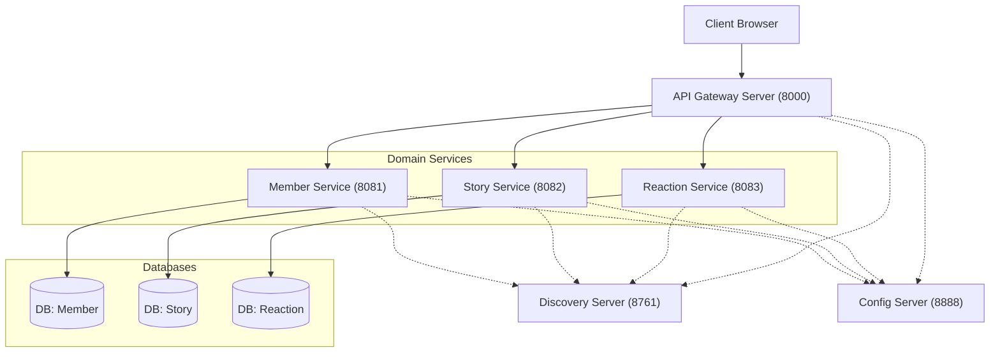

# 🎯 MSA 전환 완료 상태 문서 (MSA Implementation Status)

> **Last Updated:** 2026-01-15
> **Status:** ✅ 전체 MSA 전환 완료 (Production Ready)
> **특징:** 빌드 완료, 설정 중앙 관리(Config Server), 안정성(Circuit Breaker), 모든 JavaDoc 문서화 완료

---

## 📊 전환 완료 현황 (Summary)

### ✅ 완료된 작업 요약

| 카테고리 | 작업 | 상태 | 비고 |
|---------|------|------|------|
| **인프라** | Discovery Server 구축 | ✅ 완료 | Eureka (Port 8761) |
| **인프라** | API Gateway 구축 | ✅ 완료 | Spring Cloud Gateway + JWT Filter |
| **인프라** | Config Server 구축 | ✅ 완료 | 중앙 설정 관리 |
| **데이터베이스** | DB 분리 (3개) | ✅ 완료 | member, story, reaction |
| **공통** | common-module 생성 | ✅ 완료 | Feign DTOs, Resilience4j 설정 |
| **서비스** | member-service 이관 | ✅ 완료 | 내부 API 구현 |
| **서비스** | story-service 이관 | ✅ 완료 | Feign Client 통합 |
| **서비스** | reaction-service 이관 | ✅ 완료 | 양방향 Feign 통합 |
| **통신** | Feign Client 구현 | ✅ 완료 | MemberServiceClient, StoryServiceClient |
| **안정성** | Circuit Breaker 적용 | ✅ 완료 | Resilience4j, Fallback 처리 |
| **안정성** | Load Balancing | ✅ 완료 | Spring Cloud LoadBalancer |
| **빌드** | 전체 MSA 빌드 | ✅ 성공 | 43 tasks, 21초 |
| **기능** | WebSocket (실시간) | ✅ 완료 | story-service 기동 |
| **UI/UX** | Frontend Polish | ✅ 완료 | 로고 폰트(Gaegu), 모달 UX, 503 에러 해결 |
| **문서화** | JavaDoc 추가 | ✅ 완료 | 모든 Java 파일에 작성자 정보 포함 |
| **문서화** | Swagger 개선 | ✅ 완료 | 전체 API @Operation, @Schema 적용 |
| **테스트** | 단위 테스트 | ✅ 완료 | Service Layer JUnit + Mockito |

---

## 📝 상세 구현 체크리스트 (Implementation Details)

### 1. 데이터베이스 분리
- [x] **Schema Scripts**:
  - `01-create-databases.sql`: DB 생성 및 계정 설정
  - `02-member-service-schema.sql`: Member 스키마
  - `03-story-service-schema.sql`: Story 스키마
  - `04-reaction-service-schema.sql`: Reaction 스키마
- [x] 샘플 데이터 포함
- [x] 상세 가이드 작성 (`database-scripts/README.md`)

### 2. Common Module (공통 라이브러리)
- [x] **Core Classes**:
  - `BaseEntity.java` (JPA Auditing)
  - `ErrorCode.java` (MSA 확장)
  - `BusinessException.java` (Custom Exception)
  - `ApiResponse.java` (Standard Format)
- [x] **Utils**:
  - `GlobalExceptionHandler.java`
  - `SecurityUtil.java` (Gateway 헤더 기반 인증 처리)
- [x] **Dependencies**: Resilience4j, Spring Cloud 추가

### 3. Services Implementation
- [x] **Member Service**: `auth` 패키지, JWT 로직, Internal API 구현
- [x] **Story Service**: `book`/`query` 패키지 이관, Writer ID 참조 변경, Feign Client 구현
- [x] **Reaction Service**: `reaction` 패키지 이관, 양방향 의존성 해결 (Feign)
- [x] **Gateway Server**: `JwtAuthenticationFilter` (토큰 검증), Route 설정

### 4. Stability & Testing
- [x] **Circuit Breaker**: Resilience4j 적용 (Failure Rate Threshold 50%)
- [x] **Fallback**: 외부 서비스 장애 시 기본값 반환 처리
- [x] **Load Balancing**: Spring Cloud LoadBalancer (Client-Side)
- [x] **Testing**: JUnit + Mockito 단위 테스트, HTTP Client 테스트 파일 작성

---

## 🚦 서비스 기동 및 포트 정보

### 1. 서비스별 포트 (Service Ports)

| 서비스명 | 포트 (Port) | 역할 |
|:---|:---:|:---|
| **Config Server** | 8888 | 중앙 설정 관리 (Git) |
| **Discovery Server** | 8761 | 서비스 등록 및 탐색 (Eureka) |
| **Gateway Server** | 8000 | API 라우팅 및 JWT 필터 |
| **Member Service** | 8081 | 회원 및 인증 관리 |
| **Story Service** | 8082 | 소설 및 문장 관리 (WebSocket) |
| **Reaction Service** | 8083 | 댓글 및 투표 관리 |

### 2. 권장 실행 순서

1. **Config Server** (기동 완료 후 5~10초 대기)
2. **Discovery Server** (기동 완료 후 Eureka 대시보드 확인)
3. **Domain Services** (Member → Story → Reaction 순서 권장)
4. **Gateway Server** (최종 진입점)

---

## 🔧 빌드 및 실행 명령어 (Build Commands)

```bash
# 전체 빌드 (테스트 제외)
./gradlew clean build -x test

# 전체 실행 (병렬)
./gradlew bootRun --parallel
```

---

## 🏗️ MSA 아키텍처 구조



---

## 🔄 Monolithic → MSA 전환 핵심 변경사항

### 1. JPA 관계 제거 → ID 참조 전환 (Logic Reference)

#### Before (Monolithic)
```java
// ❌ 객체 참조 (Cross-DB JOIN 불가)
@Entity
public class Book {
    @ManyToOne
    @JoinColumn(name = "writer_id")
    private Member writer;  // JPA 객체 참조
}
```

#### After (MSA)
```java
// ✅ ID 참조 + Feign Client
@Entity
public class Book {
    @Column(name = "writer_id")
    private Long writerId;  // ID만 저장
}
```

### 2. Cross-DB JOIN 제거 → Application Level Join

#### Before (Monolithic)
- MyBatis에서 `LEFT JOIN users` 직접 사용

#### After (MSA)
- **Service Layer**에서 **Feign Client**(`MemberServiceClient`)로 데이터 조회 후 조합
- `Circuit Breaker`가 적용되어 장애 시 Fallback 처리됨

### 3. N+1 문제 방지: Batch API 구현

- **Solution**: `getMembersBatch(List<Long> ids)` API를 구현하여 한 번의 네트워크 호출로 다건 조회

### 4. SecurityUtil Header 기반 인증

- **Before**: `SecurityContextHolder` 접속 (세션 기반)
- **After**: Gateway가 주입한 `X-User-Id` 헤더 파싱

---

**Completion Date:** 2026-01-15
**Result:** Monolithic 아키텍처에서 MSA로의 전환이 성공적으로 완료됨.
