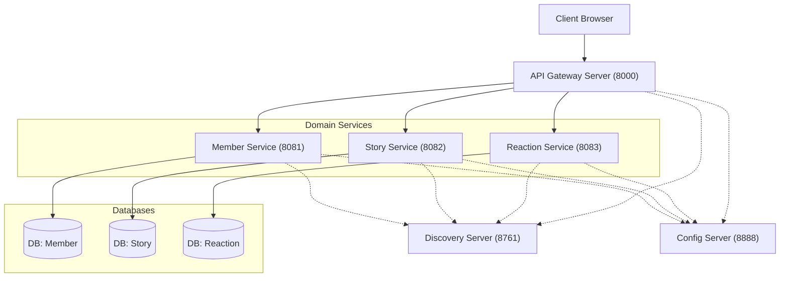
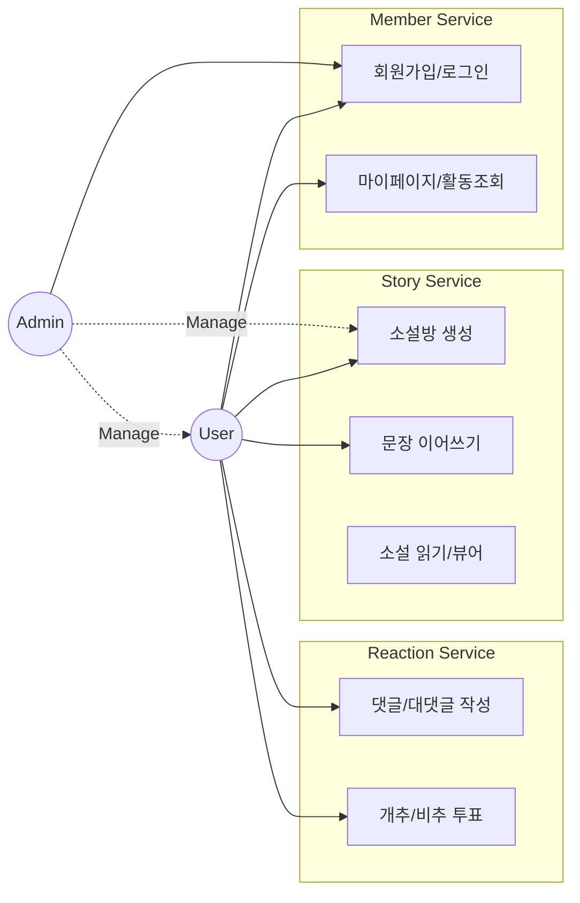
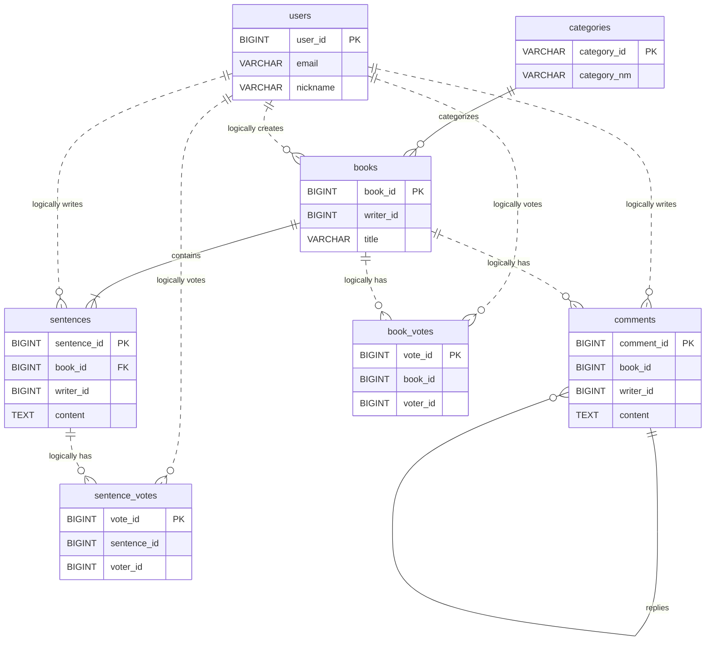
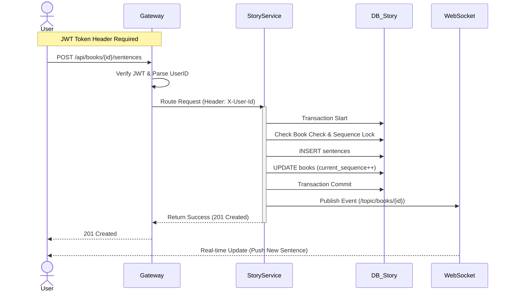

# 🏗️ Next Page : Microservices Architecture (MSA) Project

> **우리가 함께 만드는 실시간 릴레이 소설 - MSA 버전**
> 본 디렉토리는 `next-page` 모놀리식 프로젝트를 3개의 도메인 서비스와 인프라 서비스로 분리한 전문 MSA 프로젝트입니다.

---

## 📑 프로젝트 개요

- **목적:** 도메인 기반 서비스 분리를 통한 확장성, 장애 격리, 독립 배포 가능한 시스템 구축
- **아키텍처:** Spring Cloud 기반 Microservices Architecture
- **전환 배경:** Monolithic의 한계 극복 - 부분 장애 시 전체 시스템 다운, 확장성 제한, 배포 복잡도
- **핵심 기술:**
  - **Service Discovery:** Netflix Eureka (서비스 자동 등록/탐색)
  - **API Gateway:** Spring Cloud Gateway (JWT 인증, 라우팅, 헤더 주입)
  - **Configuration:** Spring Cloud Config (Git 기반 중앙 설정 관리)
  - **Communication:** OpenFeign (서비스 간 통신, Common Module 통합)
  - **Database:** MariaDB (Database per Service 패턴, 3개 독립 DB)
  - **Persistence:** JPA (Command) + MyBatis (Query) Hybrid 패턴
  - **Real-time:** WebSocket (STOMP) - 타이핑 인디케이터, 실시간 업데이트
  - **Frontend:** Vue 3 + Vite (모바일 반응형 디자인 지원)

---

## 🏗️ 시스템 구성도



---

## 🗺️ Use Case Scenario

사용자와 관리자가 시스템에서 수행할 수 있는 주요 시나리오입니다.



---

## 💾 ERD (Entity Relationship Diagram)

MSA 환경에 맞춰 **Database per Service** 패턴이 적용된 구조입니다. 서비스 간 참조는 ID(Logical Reference)로만 이루어집니다.



---

## 🔄 Sequence Diagram: 문장 이어쓰기

사용자가 문장을 작성하고 실시간으로 반영되는 전체 흐름입니다.



---

## 🚦 시작하기 (Quick Start)

### 📋 사전 요구사항 (Prerequisites)

1. **JDK 17+** (Amazon Corretto 또는 Azul Zulu 권장)
2. **MariaDB 10.6+** (3개의 독립 데이터베이스 필요)
3. **Git** (Config Server 설정용)
4. **Gradle 8.5+** (wrapper 포함)

### 1️⃣ 데이터베이스 설정

`database-scripts` 디렉토리의 SQL 스크립트를 순서대로 실행하여 3개의 독립 데이터베이스를 생성합니다.

```bash
cd database-scripts
# MariaDB 접속 후
source 01-create-databases.sql
source 02-member-service-schema.sql
source 03-story-service-schema.sql
source 04-reaction-service-schema.sql
```

📖 **자세한 가이드:** [database-scripts/README.md](database-scripts/README.md)

### 2️⃣ 환경 설정 (Configuration)

#### Option A: Local Config (권장 - 개발 환경)
각 서비스의 `application.yml`에서 직접 설정 관리 (이미 기본 설정됨)

#### Option B: Config Server (권장 - 운영 환경)
1. Git 저장소에 설정 파일 업로드
2. `config-server/application.yml`에서 Git URI 설정
3. Config Server 우선 기동

### 3️⃣ 서비스 실행 순서 ⚠️ 중요

**의존성 관계**로 인해 반드시 아래 순서대로 기동해야 합니다:

```bash
# 🟢 1단계: 인프라 서비스
cd config-server && ./gradlew bootRun        # (선택) Port 8888
# ⏱️ 5~10초 대기 후

cd discovery-server && ./gradlew bootRun     # Port 8761
# ✅ http://localhost:8761 Eureka 대시보드 확인

# 🟡 2단계: 도메인 서비스 (순서 무관, 동시 실행 가능)
cd member-service && ./gradlew bootRun       # Port 8081
cd story-service && ./gradlew bootRun        # Port 8082
cd reaction-service && ./gradlew bootRun     # Port 8083

# 🔵 3단계: API Gateway (최종 진입점)
cd gateway-server && ./gradlew bootRun       # Port 8000
```

**빠른 실행 (모든 서비스 동시 기동):**
```bash
# 루트 디렉토리에서
./gradlew bootRun --parallel
```

### 4️⃣ 프론트엔드 실행 (Vue 3)

별도의 Node.js 설치 없이 Gradle을 통해 자동 실행됩니다.

```bash
# Windows
.\gradlew :frontend:start

# macOS/Linux
./gradlew :frontend:start
```

**접속:** http://localhost:3000

> **💡 Tip:** Node.js가 이미 설치되어 있다면 `frontend` 디렉토리에서 `npm run dev` 직접 실행도 가능합니다.

### 5️⃣ 서비스 확인

| 서비스 | URL | 용도 |
|:---|:---|:---|
| **Frontend** | http://localhost:3000 | 사용자 웹 인터페이스 |
| **API Gateway** | http://localhost:8000 | REST API 진입점 |
| **Eureka Dashboard** | http://localhost:8761 | 서비스 등록 상태 확인 |
| **Member Swagger** | http://localhost:8081/swagger-ui.html | Member API 문서 |
| **Story Swagger** | http://localhost:8082/swagger-ui.html | Story API 문서 |
| **Reaction Swagger** | http://localhost:8083/swagger-ui.html | Reaction API 문서 |

---

## 🛠️ 트러블슈팅

### Redis 연결 오류
- **증상:** `Could not connect to Redis`
- **해결:** 현재 프로젝트는 Redis를 사용하지 않습니다. 관련 의존성 제거되었는지 확인

### 503 Service Unavailable
- **원인:** 서비스가 Eureka에 등록되지 않았거나 아직 기동 중
- **해결:** Eureka Dashboard에서 모든 서비스 등록 확인 (30초~1분 소요)

### Config Server 연결 실패
- **원인:** Config Server가 먼저 기동되지 않음
- **해결:** Config Server → Discovery Server → 도메인 서비스 순서 준수

### Feign Client 호출 실패
- **증상:** `FeignException: Service Unavailable` 또는 `Connection refused`
- **원인1:** 호출하려는 서비스가 Eureka에 등록되지 않음
- **원인2:** 서비스명이 잘못됨 (대소문자 구분)
- **해결:**
  1. Eureka Dashboard에서 서비스 등록 확인
  2. `@FeignClient(name = "member-service")` 이름 확인 (소문자 권장)
  3. Circuit Breaker 로그 확인

### WebSocket 연결 실패
- **증상:** `WebSocket connection failed`
- **원인:** Story Service 또는 Reaction Service가 기동되지 않음
- **해결:**
  1. Story Service (포트 확인) 정상 기동 확인
  2. CORS 설정 확인 (Gateway CorsConfig)
  3. 브라우저 콘솔에서 WebSocket URL 확인 (`ws://localhost:{port}/ws`)

### 401 Unauthorized (Gateway)
- **증상:** 인증된 요청인데도 401 에러 발생
- **원인:** JWT 토큰 형식 오류 또는 만료
- **해결:**
  1. Authorization 헤더 형식 확인: `Bearer {token}` (Bearer 뒤 공백 필수)
  2. Access Token 만료 시 `/api/auth/refresh`로 토큰 갱신
  3. Gateway 로그에서 JWT 검증 실패 원인 확인

### 403 Forbidden
- **증상:** 로그인했는데도 특정 API 호출 시 403 에러
- **원인:** 권한 부족 (일반 사용자가 관리자 API 호출 등)
- **해결:**
  1. SecurityUtil로 현재 사용자 역할 확인
  2. API 명세서에서 해당 엔드포인트의 권한 요구사항 확인
  3. 본인 소유 리소스가 아닌 경우 (예: 타인의 소설 삭제) 권한 없음

### N+1 문제 발생
- **증상:** 소설 목록 조회 시 응답 속도가 매우 느림
- **원인:** Batch API를 사용하지 않고 반복문에서 Feign Client 호출
- **해결:**
  1. `MemberServiceClient.getMembersBatch()` 사용
  2. 목록 조회 시 ID를 먼저 추출하고 Batch로 한 번에 조회
  3. MyBatis 쿼리 최적화 (인덱스 활용)

---

## 📚 관련 문서

- **[API 명세서](API_SPECIFICATION.md):** REST API 및 WebSocket 상세 스펙, Internal API 포함
- **[기술 아키텍처](TECH_ARCHITECTURE.md):** MSA 아키텍처 상세 설명, Feign Client, CQRS 패턴
- **[MSA 전환 완료 보고서](MSA_IMPLEMENTATION_COMPLETE.md):** 전환 과정 및 변경 사항 상세
- **[데이터베이스 가이드](database-scripts/README.md):** 데이터베이스 스키마 및 설치 가이드
- **[통합 개발자 가이드](../DEVELOPER_GUIDE.md):** 아키텍처 및 코딩 컨벤션
- **[팀 그라운드 룰 (XP)](../GROUND_RULES.md):** 협업 규칙 및 XP 핵심 가치

---

## 🎯 주요 기능

### 회원 관리 (Member Service)
- **회원가입/로그인**: 일반 회원 및 관리자 계정 지원
- **JWT 인증**: Access Token (30분) + Refresh Token (7일) 기반 Stateless 인증
- **관리자 승인 시스템**: 관리자 계정은 기존 관리자의 승인 필요
- **중복 검증**: 이메일, 닉네임 실시간 중복 체크
- **마이페이지**: 내 정보 조회 및 활동 내역 확인

### 소설 관리 (Story Service)
- **릴레이 소설 생성**: 카테고리별 소설방 개설
- **문장 이어쓰기**: 실시간 문장 추가 및 WebSocket 알림
- **소설 뷰어**: 전체 문장 통합 조회 및 작성자 정보 표시
- **검색 및 필터링**: 키워드, 카테고리별 소설 검색
- **완결 처리**: 자동/수동 완결 시스템
- **CQRS 패턴**: 쓰기(JPA), 읽기(MyBatis) 최적화

### 반응 관리 (Reaction Service)
- **댓글 시스템**: 댓글 및 대댓글 (계층 구조) 지원
- **투표 기능**: 소설 및 문장별 좋아요/싫어요 투표
- **집계 기능**: 투표 수 및 댓글 수 실시간 집계
- **내 활동 조회**: 내가 작성한 댓글 목록 조회

### 실시간 기능 (WebSocket)
- **타이핑 인디케이터**: 문장/댓글 작성 중 상태 실시간 표시
- **실시간 업데이트**: 새 문장/댓글 추가 시 자동 화면 갱신
- **소설 생성 알림**: 메인 페이지에서 새 소설 생성 알림
- **댓글 알림**: 댓글 작성 시 소설 페이지에 실시간 알림 (서비스 간 WebSocket 연동)
- **투표 업데이트**: 좋아요/싫어요 투표 시 실시간 집계 결과 반영
- **소설 완결 알림**: 소설 완결 시 실시간 상태 변경 알림

**WebSocket 토픽**:
- Story Service: `/topic/typing/{bookId}`, `/topic/comment-typing/{bookId}`, `/topic/books/new`, `/topic/sentences/{bookId}`, `/topic/comments/{bookId}`, `/topic/books/{bookId}/status`
- Reaction Service: `/topic/books/{bookId}/votes`

### 프론트엔드 (Vue 3)
- **반응형 디자인**: 데스크탑 및 모바일 최적화
- **SPA 라우팅**: Vue Router 기반 페이지 전환
- **상태 관리**: Pinia를 통한 중앙 상태 관리
- **실시간 통신**: STOMP.js를 이용한 WebSocket 연동

---

## 🔧 기술 스택

### Backend
- **Framework**: Spring Boot 3.2.1
- **Cloud**: Spring Cloud 2023.0.0 (Eureka, Gateway, Config, OpenFeign)
- **Security**: Spring Security + JWT
- **Persistence**:
  - JPA (Hibernate) - Command (쓰기)
  - MyBatis - Query (읽기)
- **Database**: MariaDB 10.6+
- **Real-time**: Spring WebSocket (STOMP)
- **Build Tool**: Gradle 8.5

### Frontend
- **Framework**: Vue 3.3
- **Build Tool**: Vite 4.5
- **State Management**: Pinia 2.1
- **HTTP Client**: Axios 1.6
- **WebSocket**: @stomp/stompjs 7.0, sockjs-client 1.6
- **Router**: Vue Router 4.2

### Infrastructure
- **Service Discovery**: Netflix Eureka
- **API Gateway**: Spring Cloud Gateway (JWT 필터, 헤더 주입)
- **Config Server**: Spring Cloud Config (Git 기반 중앙 설정)
- **Load Balancing**: Spring Cloud LoadBalancer (Client-Side)
- **Circuit Breaker**: Resilience4j (장애 격리 및 Fallback)

### 공통 모듈 (Common Module)
- **Feign Clients**: 서비스 간 통신 인터페이스 중앙 관리
- **공통 DTO**: MemberInfoDto, BookInfoDto, CommentNotificationDto 등
- **응답 형식**: ApiResponse (통일된 API 응답 구조)
- **예외 처리**: GlobalExceptionHandler, BusinessException
- **유틸리티**: SecurityUtil (Gateway 헤더 기반 인증)

---

**Last Updated:** 2026-01-16
**Status:** ✅ Production Ready
