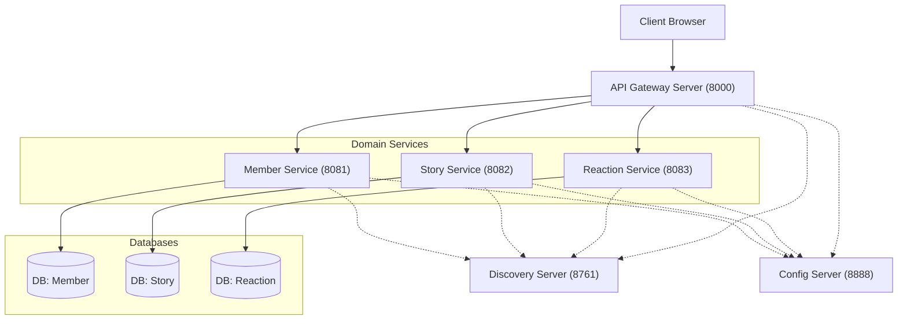

# 📘 Next Page Architecture Master Guide (MSA)
> **문서 등급:** Level 3 (Deep Dive)
> **대상:** 주니어 백엔드 개발자, 시스템 아키텍트를 지망하는 개발자
> **목표:** 이 문서를 정독하면 Next Page 프로젝트의 모든 기술적 의사결정을 이해하고, 타인에게 논리적으로 설명할 수 있다.

---

## 🏗️ 1. 아키텍처 개론: 왜 MSA인가?

### 1-1. Monolithic의 한계와 고통
우리가 처음 만들었던 **Monolithic(단일)** 구조는 `NextPageApplication.java` 하나만 실행하면 모든 기능인 회원, 소설, 댓글 기능이 돌아갔습니다.

*   **문제점 1 (빌드 속도):** "댓글 기능에 오타가 있어서 고쳤는데, 회원가입 기능까지 다시 빌드하고 배포해야 해요."
*   **문제점 2 (장애 전파):** "누가 실시간 채팅(WebSocket)을 미친듯이 써서 메모리가 터졌는데, 멀쩡하던 소설 조회 기능까지 같이 죽었어요."
*   **문제점 3 (기술 종속):** "댓글 서비스는 Node.js로 짜면 더 빠를 것 같은데... 자바로 이미 다 짜여있어서 못 바꿔요."

### 1-2. MSA (Microservices Architecture)로의 진화
우리는 거대한 하나의 덩어리를 **도메인(업무 영역)** 기준으로 쪼갰습니다. 이것이 **Next Page MSA**입니다.

> **💡 핵심 개념:** "도메인(Domain)"이란?
> 소프트웨어로 해결하고자 하는 문제의 영역입니다. 우리는 `Member`(회원), `Story`(소설), `Reaction`(반응) 3개의 도메인으로 나누었습니다.

| 서비스명 | 역할 (Role) | 비유 (Analogy) |
|:---|:---|:---|
| **Member Service** | 회원가입, 로그인, 내 정보 관리 | **동사무소/보안팀:** 신분증(JWT) 발급 및 관리 |
| **Story Service** | 소설 생성, 문장 이어쓰기, 목록 조회 | **도서관/집필실:** 책을 보관하고 작가가 글을 쓰는 곳 |
| **Reaction Service** | 댓글, 대댓글, 좋아요 투표 | **광장/검표소:** 사람들이 떠들고 투표하는 곳 |

---

## 🛠️ 2. 인프라스트럭처 (Infrastructure): 시스템의 뼈대

MSA는 서비스들이 파편화되어 있기 때문에, 이들을 관리해줄 **매니저**들이 필요합니다.



### 2-1. Config Server (설정 관리자)
*   **문제:** 서비스가 3개인데, `application.yml` 설정 파일도 3개입니다. DB 비밀번호를 바꾸려면 3번 수정하고 3번 재배포해야 합니다.
*   **해결:** `Next Page Config Server`를 만들었습니다.
    *   모든 설정(`*.yml`)을 **GitHub** (예: `next-page-config` 리포지토리) 한곳에 몰아넣습니다.
    *   각 서비스는 켜질 때 Config Server에게 **"내 설정 파일 좀 줘!"** 하고 받아옵니다.
    *   **구조 예시:**
        ```
        next-page-config/ (Git Repository)
        ├── member-service.yml
        ├── story-service.yml
        ├── reaction-service.yml
        └── gateway-server.yml
        ```
    *   **효과:** 
        - 설정이 바뀌면 GitHub 코드만 고치고 `/actuator/refresh` 엔드포인트 호출로 재시작 없이 반영
        - 환경별 설정 분리 (dev, staging, prod) 용이
        - 민감 정보(DB 비밀번호, API Key) 중앙 암호화 관리 가능

### 2-2. Eureka Discovery Server (위치 추적기)
*   **문제:** MSA에서는 서비스가 클라우드 환경에서 IP가 수시로 바뀔 수 있습니다. `Member Service`가 `Story Service`를 호출하려면 IP를 알아야 하는데, 하드코딩할 수 없습니다.
*   **해결:** **Eureka(유레카)** 라는 전화번호부를 도입했습니다.
    1.  **서비스 등록:** `Story Service`가 켜질 때, "저 여기 있어요! (IP: 192.168.0.5)"라고 Eureka에 신고합니다.
    2.  **서비스 발견:** `Gateway`가 요청을 보낼 때 Eureka에게 "Story Service 어디 있어?"라고 물어보고 찾아갑니다.
    3.  **Client-Side Discovery:** 이 방식은 클라이언트(요청자)가 서비스 위치를 찾는 방식입니다.

### 2-3. API Gateway (정문 & 경비실)
*   **질문:** 클라이언트(프론트엔드)는 `Member`, `Story`, `Reaction` 서비스의 IP를 다 알아야 할까요?
*   **답변:** 아니요! 보안상 위험하고 너무 복잡합니다.
*   **해결:** **Spring Cloud Gateway**를 유일한 출입구로 둡니다. (Port 8000)
    *   **라우팅(Routing):** `/api/books`로 들어오면 `Story Service`로, `/api/auth`로 들어오면 `Member Service`로 토스합니다.
    *   **필터링(Filtering):** 들어오는 요청을 가로채서 **JWT 인증**을 수행합니다. "신분증 안 가져왔어? 돌아가!"

### 2-4. Service Load Balancing (트래픽 분산)
*   **문제:** `Story Service`에 사용자가 너무 몰려서 서버를 하나 더 띄웠습니다(Scale-out). 그럼 게이트웨이나 다른 서비스는 이 두 개의 서버 중 어디로 요청을 보내야 할까요?
*   **해결:** **Client-Side Load Balancing** 방식을 사용합니다. (Spring Cloud LoadBalancer)
    1.  **Eureka 연동:** 게이트웨이와 모든 서비스는 Eureka로부터 "현재 살아있는 서버 명단"을 주기적으로 받아옵니다.
    2.  **자동 분산:** 요청을 보낼 때마다 명단에 있는 서버들에게 번갈아가며(Round Robin 등) 요청을 보냅니다.
    3.  **장점:** 값비싼 하드웨어 로드밸런서(L4/L7 스위치) 없이도 소프트웨어만으로 똑똑하게 트래픽을 분산할 수 있습니다.

---

## 💎 3. 백엔드 핵심 기술 (Core Tech Stack)

### 3-1. Persistence Layer: JPA와 MyBatis의 동거 (CQRS Lite)
우리는 **"쓰기는 정교하게, 읽기는 빠르게"** 라는 철학을 가집니다.

#### 🍊 JPA (Hibernate) - Command (쓰기)
*   **사용처:** `INSERT`, `UPDATE`, `DELETE` 등 데이터의 상태를 변경할 때.
*   **왜 썼나요?**
    *   **객체지향적:** SQL을 몰라도 자바 객체(`Entity`)를 다루듯 DB를 조작할 수 있습니다.
    *   **안전장치:** `Dirty Checking`(변경 감지) 기능 덕분에, 객체 값을 바꾸기만 하면 트랜잭션이 끝날 때 알아서 `UPDATE` 쿼리가 나갑니다.
*   **코드 예시:**
    ```java
    // 자바 코드로만 작성했지만, 실제로는 DB에 INSERT가 발생함
    Book book = Book.create(title, content);
    bookRepository.save(book); 
    ```

#### 🦋 MyBatis - Query (읽기)
*   **사용처:** 복잡한 검색, 통계, 다중 필터링 조회.
*   **왜 썼나요?**
    *   **JPA의 한계:** JPA로 "카테고리가 스릴러이면서, 조회수가 100 이상이고, 최근 3일 내 생성된 글"을 조회하려면 코드가 매우 복잡해지거나 비효율적인 쿼리가 나갑니다.
    *   **SQL 제어권:** MyBatis는 개발자가 SQL `SELECT` 문을 직접 작성합니다. 인덱스를 타게 하거나 튜닝하기에 훨씬 유리합니다.
    *   **동적 쿼리:** `<if test="category != null">` 같은 태그를 써서 상황에 따라 SQL을 자유자재로 바꿀 수 있습니다.

---

## 🔐 4. 보안 아키텍처 (Security Flow)

보안은 **"누구냐(Authentication)"** 와 **"무엇을 할 수 있냐(Authorization)"** 의 싸움입니다.

### 4-1. JWT (JSON Web Token) 전략
우리는 세션(Session)을 쓰지 않습니다. 세션은 서버 메모리에 저장되는데, 서버가 여러 대(MSA)면 세션 동기화가 어렵기 때문입니다. 대신 **Stateless(무상태)** 한 JWT를 씁니다.

1.  **발급:** 로그인 성공 시 `AccessToken`(30분), `RefreshToken`(7일)을 발급합니다.
2.  **저장:** `AccessToken`은 프론트엔드 변수나 헤더에, `RefreshToken`은 보안 쿠키(HttpOnly)에 저장하여 XSS 공격을 방지합니다.

### 4-2. Gateway Security Filter
가장 중요한 부분입니다. 개별 서비스(`Member`, `Story`)는 JWT 검증 로직이 없습니다! 모든 검증은 **Gateway**에서 끝납니다.

*   **1단계:** Gateway Filter가 요청 헤더(`Authorization`)를 낚아챕니다.
*   **2단계:** JWT 서명이 올바른지 확인합니다. (위조된 토큰이면 즉시 `401 Error`)
*   **3단계:** 토큰 안에 있는 유저 ID(`7`)와 역할(`USER`)을 꺼냅니다.
*   **4단계:** 이 정보를 HTTP 헤더 `X-User-Id: 7`, `X-User-Role: USER`로 변환해서 내부 서비스로 넘겨줍니다.
*   **5단계:** 내부 서비스는 복잡한 인증 로직 없이 `request.getHeader("X-User-Id")`만 하면 끝입니다.

---

## 📡 5. 서비스 간 통신 (Inter-Service Communication)

"소설 서비스"가 소설 목록을 보여주려는데, "작성자 닉네임"이 필요합니다. 닉네임은 "회원 서비스"에 있습니다. 어떻게 가져올까요?

### 5-1. OpenFeign: 우아한 REST Client
옛날에는 `RestTemplate`이라는 걸 써서 URL을 직접 문자열로 적었습니다.
```java
// 구방식 (RestTemplate) - 실수하기 딱 좋음
String url = "http://member-service/members/" + writerId;
restTemplate.getForObject(url, MemberDto.class);
```

우리는 **Feign Client**를 씁니다. 그냥 인터페이스만 만들면 됩니다.
```java
// 신방식 (Feign) - 마치 내 옆에 있는 메소드 부르듯이!
@FeignClient(name = "member-service")
public interface MemberServiceClient {
    @GetMapping("/internal/members/{memberId}")
    ApiResponse<MemberInfoDto> getMemberInfo(@PathVariable("memberId") Long memberId);
}
```
**작동 원리:** Spring이 런타임에 이 인터페이스의 구현체(Proxy)를 자동으로 만들어서, 실제 HTTP 요청을 날려줍니다.

#### Feign Client의 서비스 디스커버리 통합
1. **서비스 이름 사용**: `@FeignClient(name = "member-service")`에서 "member-service"는 Eureka에 등록된 서비스 이름입니다.
2. **자동 로드 밸런싱**: member-service가 여러 인스턴스로 실행 중이면, Spring Cloud LoadBalancer가 자동으로 요청을 분산합니다.
3. **장애 격리**: 특정 인스턴스가 다운되면 자동으로 다른 인스턴스로 요청을 보냅니다.

### 5-2. Common Module: Feign Client 중앙 관리

우리 프로젝트의 핵심 전략 중 하나는 **Common Module**을 통한 Feign Client 중앙 관리입니다.

#### 문제 상황
- Story Service가 Member Service를 호출하고, Reaction Service도 Member Service를 호출합니다.
- 각 서비스마다 `MemberServiceClient` 인터페이스를 복사-붙여넣기 하면?
- Member Service의 API가 바뀌면 모든 서비스에서 수정해야 합니다. (유지보수 지옥)

#### 해결책: Common Module
```
common-module/
├── src/main/java/com/team2/commonmodule/
│   ├── feign/
│   │   ├── MemberServiceClient.java        ← Member Service 호출
│   │   ├── StoryServiceClient.java         ← Story Service 호출
│   │   ├── ReactionServiceClient.java      ← Reaction Service 호출
│   │   └── dto/                             ← 공통 DTO
│   │       ├── MemberInfoDto.java
│   │       ├── BookInfoDto.java
│   │       └── ...
│   ├── response/
│   │   └── ApiResponse.java                 ← 통일된 응답 형식
│   └── exception/
│       └── GlobalExceptionHandler.java      ← 통일된 예외 처리
```

#### Common Module의 장점
1. **단일 진실 공급원**: Feign Client가 한 곳에만 정의되어 있어 변경이 쉽습니다.
2. **타입 안전성**: DTO를 공유하므로 컴파일 타임에 오류를 잡을 수 있습니다.
3. **일관성**: 모든 서비스가 동일한 응답 형식(`ApiResponse`)을 사용합니다.
4. **재사용성**: 예외 처리, 유틸리티 클래스 등을 공유합니다.

#### 사용 방법
각 서비스의 `build.gradle`에 Common Module을 의존성으로 추가:
```gradle
dependencies {
    implementation project(':common-module')
}
```

그러면 어떤 서비스에서든 Common Module의 Feign Client를 바로 사용 가능:
```java
@Service
@RequiredArgsConstructor
public class BookService {
    private final MemberServiceClient memberServiceClient;  // Common Module에서 가져옴

    public BookDetailDto getBookWithWriter(Long bookId) {
        Book book = bookRepository.findById(bookId);

        // Member Service 호출 (내부적으로 Eureka를 통해 위치 찾음)
        ApiResponse<MemberInfoDto> response =
            memberServiceClient.getMemberInfo(book.getWriterId());

        return BookDetailDto.of(book, response.getData());
    }
}
```

### 5-3. Application Level Join (Aggregation)
MSA의 가장 큰 단점은 **JOIN을 못한다**는 것입니다. DB가 쪼개져 있으니까요. 그래서 우리는 **"메모리에서 조립"** 합니다.

#### N+1 문제를 방지하는 Batch 조회 패턴

**나쁜 예시 (N+1 문제 발생):**
```java
// 소설 10개를 조회했다면, 회원 정보를 가져오기 위해 10번의 API 호출 발생!
List<Book> books = bookRepository.findTop10();
for (Book book : books) {
    MemberInfoDto member = memberServiceClient.getMemberInfo(book.getWriterId());
    // ... 처리
}
```

**좋은 예시 (Batch 조회로 1번만 호출):**
```java
// 1. 소설 목록 조회
List<Book> books = bookRepository.findTop10();

// 2. 작성자 ID 목록 추출
List<Long> writerIds = books.stream()
    .map(Book::getWriterId)
    .distinct()
    .collect(Collectors.toList());

// 3. Batch API로 한 번에 조회 (10개 → 1번의 HTTP 요청)
ApiResponse<MemberBatchInfoDto> response =
    memberServiceClient.getMembersBatch(writerIds);
Map<Long, MemberInfoDto> memberMap = response.getData().getMembers();

// 4. 메모리에서 조립
List<BookListDto> result = books.stream()
    .map(book -> {
        MemberInfoDto writer = memberMap.get(book.getWriterId());
        return BookListDto.of(book, writer);
    })
    .collect(Collectors.toList());
```

#### Application Level Join의 5단계
1.  **Story Service:** DB에서 소설 목록 10개를 가져옵니다. (작성자 ID만 있음: `[1, 5, 3, 1, 5 ...]`)
2.  **ID 추출 & 중복 제거:** Distinct로 유니크한 ID만 추출 (`[1, 3, 5]`)
3.  **Feign Batch Call:** "회원 서비스님, ID가 1, 3, 5인 회원 정보 다 주세요." (단 1번의 HTTP 요청)
4.  **Data Map:** 받아온 회원 정보를 Map으로 만듭니다. `{1: "철수", 3: "영희", 5: "바둑이"}`
5.  **Assemble:** 소설 목록을 반복문 돌면서 Map에서 닉네임을 꺼내 채워 넣습니다.
6.  **Return:** 완성된 데이터를 프론트엔드에 줍니다.

#### 실제 구현 예시 (Story Service)
```java
@Service
@RequiredArgsConstructor
public class BookQueryService {
    private final BookMapper bookMapper;  // MyBatis
    private final MemberServiceClient memberServiceClient;  // Common Module

    public Page<BookListDto> getBookList(BookSearchCriteria criteria) {
        // 1. 소설 목록 조회 (MyBatis - 복잡한 검색 쿼리)
        List<BookListDto> books = bookMapper.selectBookList(criteria);

        // 2. 작성자 ID 추출
        List<Long> writerIds = books.stream()
            .map(BookListDto::getWriterId)
            .distinct()
            .collect(Collectors.toList());

        // 3. Member Service 호출 (Batch)
        if (!writerIds.isEmpty()) {
            ApiResponse<MemberBatchInfoDto> response =
                memberServiceClient.getMembersBatch(writerIds);
            Map<Long, MemberInfoDto> memberMap = response.getData().getMembers();

            // 4. 작성자 정보 매핑
            books.forEach(book -> {
                MemberInfoDto writer = memberMap.get(book.getWriterId());
                if (writer != null) {
                    book.setWriterNickname(writer.getNickname());
                }
            });
        }

        return new PageImpl<>(books);
    }
}
```

### 5-4. 장애 처리 전략 (Fallback)

Feign Client 호출이 실패하면 어떻게 할까요? 예를 들어 Member Service가 일시적으로 다운되었다면?

#### 현재 전략: Graceful Degradation (우아한 성능 저하)
```java
try {
    ApiResponse<MemberInfoDto> response =
        memberServiceClient.getMemberInfo(writerId);
    writerNickname = response.getData().getNickname();
} catch (FeignException e) {
    // Member Service 호출 실패 시 기본값 제공
    writerNickname = "알 수 없음 (ID: " + writerId + ")";
    log.warn("Member Service 호출 실패. WriterId: {}", writerId, e);
}
```

이렇게 하면 Member Service가 다운되어도 Story Service의 소설 목록 조회는 계속 작동합니다. (단, 작성자 이름이 "알 수 없음"으로 표시됨)

#### 향후 개선: Resilience4j Circuit Breaker
현재는 구현되지 않았지만, 추후 Resilience4j를 도입하여 자동 장애 격리를 구현할 예정입니다:
```java
@CircuitBreaker(name = "memberService", fallbackMethod = "getMemberFallback")
public MemberInfoDto getMember(Long memberId) {
    return memberServiceClient.getMemberInfo(memberId).getData();
}

private MemberInfoDto getMemberFallback(Long memberId, Exception e) {
    return MemberInfoDto.createUnknown(memberId);
}
```

---

## ⚡ 6. 실시간 통신 (Real-Time Architecture)

### 6-1. Ajax vs WebSocket: 초보를 위한 비유
*   **Ajax (HTTP):** **"무전기"** 같습니다. 버튼을 누르고 말을 해야(Request) 상대방이 대답(Response)합니다. 내가 가만히 있으면 아무 소식도 못 듣습니다. "새 글 올라왔나요?"라고 계속 물어봐야 합니다(Polling).
*   **WebSocket:** **"전화기"** 같습니다. 한번 연결되면(Handshake), 상대방이 아무 때나 말을 걸 수 있습니다. 서버가 "야! 새 글 올라왔어!"라고 먼저 알려줄 수 있습니다(Push).

### 6-2. STOMP 프로토콜
WebSocket은 그냥 "선"만 연결해주는 것입니다. 그 안에서 어떤 규칙으로 대화할지 정해야 하는데, 우리는 **STOMP** 규약을 씁니다. 이것은 **"우체통 규칙"** 과 비슷합니다.

*   **PUB (발행):** "이 편지를 `1번 우체통(/topic/books/1)`에 넣어주세요."
*   **SUB (구독):** "저는 `1번 우체통`에 편지가 오면 받을래요."

### 6-3. 구현 시나리오 (타이핑 인디케이터)
1.  **유저 A**가 키보드를 칩니다.
2.  프론트엔드 JS가 소켓으로 보냅니다. `SEND /app/typing/{bookId}`, 내용: `{ "nickname": "A", "status": "WRITING" }`
3.  백엔드(Story Service)가 받아서 그대로 뿌립니다. `BROADCAST /topic/typing/{bookId}`
4.  같은 소설을 보고 있던 **유저 B**의 JS가 메시지를 받아서 화면에 "A님이 작성 중..."을 띄웁니다.
5.  **핵심:** 이 정보는 DB에 저장하지 않습니다. 휘발성 데이터이기 때문입니다.

### 6-4. WebSocket 토픽 전체 목록 및 용도

우리 프로젝트는 **Story Service**와 **Reaction Service** 두 곳에서 WebSocket을 제공합니다.

#### Story Service WebSocket (/ws 엔드포인트)

| 토픽 경로 | 발행 시점 | 메시지 내용 | 용도 |
|:---|:---|:---|:---|
| `/topic/typing/{bookId}` | 사용자가 문장 입력 중 | `{nickname, status}` | 문장 작성 타이핑 상태 |
| `/topic/comment-typing/{bookId}` | 사용자가 댓글 입력 중 | `{nickname, status}` | 댓글 작성 타이핑 상태 |
| `/topic/books/new` | 새 소설 생성 시 | `{bookId, title, category}` | 메인 페이지 실시간 목록 갱신 |
| `/topic/sentences/{bookId}` | 문장 추가 시 | `{sentenceId, content, writer}` | 소설 뷰어 실시간 문장 추가 |
| `/topic/comments/{bookId}` | 댓글 생성 시 (Reaction → Story) | `{commentId, content, nickname}` | 소설 페이지 댓글 실시간 알림 |
| `/topic/books/{bookId}/status` | 소설 완결 시 | `{bookId, status}` | 소설 상태 변경 알림 |

#### Reaction Service WebSocket (/ws 엔드포인트)

| 토픽 경로 | 발행 시점 | 메시지 내용 | 용도 |
|:---|:---|:---|:---|
| `/topic/books/{bookId}/votes` | 투표 발생 시 | `{targetId, targetType, likeCount, dislikeCount}` | 실시간 투표 수 업데이트 |

#### 서비스 간 WebSocket 연동 패턴

**문제**: Reaction Service에서 댓글이 작성되었을 때, Story Service의 WebSocket으로 알림을 보내야 합니다.

**해결**:
1. Reaction Service에서 댓글 생성 후 `StoryServiceClient.notifyCommentCreated()` 호출 (Feign)
2. Story Service의 `InternalNotificationController`가 REST API로 요청 수신
3. Story Service가 `messagingTemplate.convertAndSend("/topic/comments/{bookId}", dto)` 실행
4. Story Service의 WebSocket을 통해 모든 구독자에게 브로드캐스트

**코드 예시**:
```java
// Reaction Service (댓글 생성 시)
@Service
public class ReactionService {
    private final StoryServiceClient storyServiceClient;

    public void createComment(CreateCommentRequest request) {
        // 1. 댓글 저장
        Comment comment = commentRepository.save(...);

        // 2. Story Service에 알림 요청
        CommentNotificationDto dto = CommentNotificationDto.builder()
            .commentId(comment.getId())
            .bookId(request.getBookId())
            .content(comment.getContent())
            .nickname(currentUser.getNickname())
            .createdAt(comment.getCreatedAt())
            .build();

        storyServiceClient.notifyCommentCreated(dto);  // Feign 호출
    }
}

// Story Service (알림 수신 및 WebSocket 브로드캐스트)
@RestController
public class InternalNotificationController {
    private final SimpMessagingTemplate messagingTemplate;

    @PostMapping("/internal/notify/comments")
    public ApiResponse<Void> notifyCommentCreated(@RequestBody CommentNotificationDto dto) {
        // WebSocket으로 브로드캐스트
        messagingTemplate.convertAndSend(
            "/topic/comments/" + dto.getBookId(),
            dto
        );
        return ApiResponse.success(null);
    }
}
```

---

## 📂 7. 공통 모듈 (Common Module) 전략

### 7-1. 왜 만들었나요?
MSA를 하다 보면 `MemberService`에서도 `ErrorResponse` 클래스가 필요하고, `StoryService`에서도 필요합니다. 복사-붙여넣기를 하면 나중에 고칠 때 지옥이 펼쳐집니다.

### 7-2. 무엇이 들어있나요?

#### 📁 공통 모듈 구조
```
common-module/
├── src/main/java/com/team2/commonmodule/
│   ├── feign/                              ← Feign Client 인터페이스
│   │   ├── MemberServiceClient.java        ← Member Service 호출
│   │   ├── StoryServiceClient.java         ← Story Service 호출
│   │   ├── ReactionServiceClient.java      ← Reaction Service 호출
│   │   └── dto/                             ← Feign 전용 DTO
│   │       ├── MemberInfoDto.java
│   │       ├── MemberBatchInfoDto.java
│   │       ├── BookInfoDto.java
│   │       ├── BookBatchInfoDto.java
│   │       ├── SentenceReactionInfoDto.java
│   │       └── ...
│   ├── response/                            ← 공통 응답 형식
│   │   ├── ApiResponse.java                 ← 통일된 API 응답 래퍼
│   │   └── ResponseCode.java                ← 응답 코드 상수
│   ├── exception/                           ← 공통 예외 처리
│   │   ├── GlobalExceptionHandler.java      ← 전역 예외 핸들러
│   │   ├── BusinessException.java           ← 비즈니스 예외
│   │   └── ErrorResponse.java               ← 에러 응답 DTO
│   └── config/                              ← 공통 설정
│       └── FeignConfig.java                 ← Feign Client 공통 설정
```

#### 주요 구성 요소

**1. Feign Client (서비스 간 통신)**
```java
@FeignClient(name = "member-service")
public interface MemberServiceClient {
    // 단건 조회
    @GetMapping("/internal/members/{userId}")
    ApiResponse<MemberInfoDto> getMemberInfo(@PathVariable("userId") Long userId);

    // 배치 조회 (N+1 방지)
    @GetMapping("/internal/members/batch")
    ApiResponse<MemberBatchInfoDto> getMembersBatch(@RequestParam("userIds") List<Long> userIds);

    // 존재 여부 확인
    @GetMapping("/internal/members/{userId}/exists")
    ApiResponse<Boolean> memberExists(@PathVariable("userId") Long userId);
}
```

**2. ApiResponse (통일된 응답 형식)**
```java
@Getter
@Builder
public class ApiResponse<T> {
    private String code;        // 응답 코드 (200, 400, 500 등)
    private String message;     // 응답 메시지
    private T data;             // 실제 데이터 (Generic)
    private LocalDateTime timestamp;  // 응답 시간

    public static <T> ApiResponse<T> success(T data) {
        return ApiResponse.<T>builder()
            .code("200")
            .message("success")
            .data(data)
            .timestamp(LocalDateTime.now())
            .build();
    }

    public static <T> ApiResponse<T> error(String code, String message) {
        return ApiResponse.<T>builder()
            .code(code)
            .message(message)
            .timestamp(LocalDateTime.now())
            .build();
    }
}
```

**3. GlobalExceptionHandler (통일된 예외 처리)**
```java
@RestControllerAdvice
public class GlobalExceptionHandler {
    // 비즈니스 예외
    @ExceptionHandler(BusinessException.class)
    public ResponseEntity<ApiResponse<Void>> handleBusinessException(BusinessException e) {
        return ResponseEntity.status(e.getStatus())
            .body(ApiResponse.error(String.valueOf(e.getStatus().value()), e.getMessage()));
    }

    // 인증 예외
    @ExceptionHandler(UnauthorizedException.class)
    public ResponseEntity<ApiResponse<Void>> handleUnauthorizedException(UnauthorizedException e) {
        return ResponseEntity.status(HttpStatus.UNAUTHORIZED)
            .body(ApiResponse.error("401", e.getMessage()));
    }

    // 검증 예외
    @ExceptionHandler(MethodArgumentNotValidException.class)
    public ResponseEntity<ApiResponse<Void>> handleValidationException(MethodArgumentNotValidException e) {
        String message = e.getBindingResult().getAllErrors().get(0).getDefaultMessage();
        return ResponseEntity.badRequest()
            .body(ApiResponse.error("400", message));
    }
}
```

**4. 공통 DTO (데이터 전송 객체)**
```java
// Member 정보 DTO
@Getter
@Builder
public class MemberInfoDto {
    private Long userId;
    private String nickname;
    private String role;
}

// Batch 조회 응답 DTO
@Getter
@Builder
public class MemberBatchInfoDto {
    private Map<Long, MemberInfoDto> members;  // Key: userId, Value: 회원 정보
}

// Book 정보 DTO
@Getter
@Builder
public class BookInfoDto {
    private Long bookId;
    private String title;
    private Long writerId;
    private String status;
}
```

### 7-3. Common Module의 장점

**1. DRY 원칙 (Don't Repeat Yourself)**
- Feign Client를 한 곳에만 정의하므로 중복 제거
- API 스펙 변경 시 Common Module만 수정하면 됨

**2. 타입 안전성 (Type Safety)**
- 컴파일 타임에 DTO 구조 검증
- IDE의 자동완성 지원으로 개발 생산성 향상

**3. 일관성 (Consistency)**
- 모든 서비스가 동일한 응답 형식 사용
- 동일한 예외 처리 전략 적용

**4. 유지보수성 (Maintainability)**
- 공통 로직을 한 곳에서 관리
- 버그 수정 시 한 번만 고치면 모든 서비스에 적용

### 7-4. 사용 예시

**build.gradle (각 서비스)**
```gradle
dependencies {
    implementation project(':common-module')
    // ... 다른 의존성
}
```

**Service Layer (Story Service)**
```java
@Service
@RequiredArgsConstructor
public class BookQueryService {
    // Common Module의 Feign Client 주입
    private final MemberServiceClient memberServiceClient;
    private final ReactionServiceClient reactionServiceClient;

    public BookDetailDto getBookDetail(Long bookId) {
        // 1. 소설 정보 조회
        Book book = bookRepository.findById(bookId).orElseThrow();

        // 2. 작성자 정보 조회 (Member Service 호출)
        ApiResponse<MemberInfoDto> memberResponse =
            memberServiceClient.getMemberInfo(book.getWriterId());

        // 3. 반응 정보 조회 (Reaction Service 호출)
        ApiResponse<BookReactionInfoDto> reactionResponse =
            reactionServiceClient.getBookReactionStats(bookId, null);

        // 4. 데이터 조립
        return BookDetailDto.builder()
            .book(book)
            .writer(memberResponse.getData())
            .reactions(reactionResponse.getData())
            .build();
    }
}
```

### 7-5. 버전 관리 전략

Common Module이 변경되면 모든 서비스에 영향을 줄 수 있으므로 신중한 버전 관리가 필요합니다:

**1. Semantic Versioning**
- Major: API 호환성이 깨지는 변경 (1.0.0 → 2.0.0)
- Minor: 기능 추가 (1.0.0 → 1.1.0)
- Patch: 버그 수정 (1.0.0 → 1.0.1)

**2. Backward Compatibility (하위 호환성)**
- 기존 메서드를 삭제하지 않고 @Deprecated 처리
- 새 메서드를 추가하여 점진적 마이그레이션

**3. 통합 테스트**
- Common Module 변경 시 모든 서비스의 통합 테스트 실행
- CI/CD 파이프라인에서 자동 검증

이 모듈은 `.jar` 파일로 빌드되어 다른 서비스들이 `build.gradle`에서 가져다 씁니다.

### 7-6. SecurityUtil: Gateway 헤더 기반 인증 유틸리티

Common Module의 가장 중요한 유틸리티 중 하나는 **SecurityUtil**입니다. 이 클래스는 Gateway에서 주입한 HTTP 헤더를 읽어 현재 사용자 정보를 제공합니다.

#### 주요 메서드

```java
public class SecurityUtil {
    // 현재 사용자 ID 조회
    public static Long getCurrentUserId() {
        // 1. Gateway 헤더에서 먼저 시도
        RequestAttributes attrs = RequestContextHolder.getRequestAttributes();
        if (attrs != null) {
            HttpServletRequest request = ((ServletRequestAttributes) attrs).getRequest();
            String userId = request.getHeader("X-User-Id");
            if (userId != null) {
                return Long.parseLong(userId);
            }
        }

        // 2. SecurityContext에서 시도 (직접 접근 시)
        Authentication auth = SecurityContextHolder.getContext().getAuthentication();
        if (auth != null && auth.getPrincipal() instanceof UserDetails) {
            UserDetails userDetails = (UserDetails) auth.getPrincipal();
            return Long.parseLong(userDetails.getUsername());
        }

        throw new UnauthorizedException("인증되지 않은 사용자입니다.");
    }

    // 현재 사용자 이메일 조회
    public static String getCurrentUserEmail() {
        return getHeaderOrAuth("X-User-Email");
    }

    // 현재 사용자 닉네임 조회
    public static String getCurrentUserNickname() {
        return getHeaderOrAuth("X-User-Nickname");
    }

    // 현재 사용자 역할 조회
    public static String getCurrentUserRole() {
        return getHeaderOrAuth("X-User-Role");
    }

    // 관리자 여부 확인
    public static boolean isAdmin() {
        return "ADMIN".equals(getCurrentUserRole());
    }

    // 본인 여부 확인
    public static boolean isCurrentUser(Long userId) {
        return getCurrentUserId().equals(userId);
    }

    // 본인 또는 관리자 여부 확인 (권한 체크에 유용)
    public static boolean isCurrentUserOrAdmin(Long userId) {
        return isCurrentUser(userId) || isAdmin();
    }

    // 인증 여부 확인
    public static boolean isAuthenticated() {
        try {
            getCurrentUserId();
            return true;
        } catch (UnauthorizedException e) {
            return false;
        }
    }
}
```

#### 사용 예시

**Service Layer에서의 권한 검증**:
```java
@Service
public class BookService {
    public void updateBook(Long bookId, UpdateBookRequest request) {
        Book book = bookRepository.findById(bookId).orElseThrow();

        // 작성자 본인 또는 관리자만 수정 가능
        if (!SecurityUtil.isCurrentUserOrAdmin(book.getWriterId())) {
            throw new ForbiddenException("소설 수정 권한이 없습니다.");
        }

        book.updateTitle(request.getTitle());
        bookRepository.save(book);
    }

    public BookDto createBook(CreateBookRequest request) {
        // 현재 로그인한 사용자 ID를 작성자로 설정
        Long currentUserId = SecurityUtil.getCurrentUserId();

        Book book = Book.builder()
            .title(request.getTitle())
            .writerId(currentUserId)  // Gateway 헤더에서 자동 추출
            .build();

        return BookDto.from(bookRepository.save(book));
    }
}
```

**Controller Layer에서의 권한 검증**:
```java
@RestController
public class MemberController {
    @DeleteMapping("/api/members/{userId}")
    public ApiResponse<Void> deleteMember(@PathVariable Long userId) {
        // 본인만 탈퇴 가능
        if (!SecurityUtil.isCurrentUser(userId)) {
            throw new ForbiddenException("본인만 탈퇴할 수 있습니다.");
        }

        memberService.deleteMember(userId);
        return ApiResponse.success(null);
    }
}
```

#### SecurityUtil의 장점

1. **중복 코드 제거**: 모든 서비스에서 동일한 방식으로 사용자 정보를 조회합니다.
2. **Fallback 지원**: Gateway 헤더가 없으면 SecurityContext에서 조회 (Swagger 직접 테스트 시)
3. **타입 안전성**: 문자열 헤더를 Long, String 등 적절한 타입으로 변환합니다.
4. **명확한 예외**: 인증되지 않은 경우 명확한 예외를 발생시킵니다.
5. **권한 체크 간소화**: `isCurrentUserOrAdmin()` 등 유틸리티 메서드로 코드가 간결해집니다.

---

## 📝 마치며: 이 문서를 읽은 당신이 할 수 있는 말
이제 누군가 **"Next Page 프로젝트는 어떻게 구성되어 있나요?"** 라고 물으면 이렇게 대답하세요.

> "저희는 **확장성**과 **장애 격리**를 위해 **Spring Cloud 기반의 MSA**를 도입했습니다.
> **Gateway**를 통해 보안을 단일화했고, 데이터 조작은 **JPA**, 복잡한 조회는 **MyBatis**를 사용하는 **CQRS Hybrid 패턴**을 적용했습니다.
> 서비스 간 통신은 **Common Module**로 중앙 관리되는 **Feign Client**를 통해 **Application Level Join**을 수행하며,
> N+1 문제는 **Batch 조회 패턴**으로 해결했습니다.
> 사용자 경험을 위해 **WebSocket(STOMP)** 으로 실시간 타이핑과 업데이트 기능을 구현했으며,
> **Database per Service** 패턴을 통해 각 도메인의 데이터 독립성을 보장했습니다."

---

## 🎯 핵심 아키텍처 결정 요약

### 1. MSA 도입 결정
- **배경**: Monolithic 구조의 한계 (부분 장애 시 전체 다운, 확장성 제한)
- **해결**: 도메인별 서비스 분리 (Member, Story, Reaction)
- **효과**: 독립 배포, 장애 격리, 기술 스택 다양화 가능

### 2. CQRS Lite 패턴
- **배경**: 쓰기와 읽기의 요구사항이 다름
- **해결**: JPA (Command), MyBatis (Query) 분리
- **효과**: 쓰기는 안전하게, 읽기는 빠르게

### 3. Common Module 전략
- **배경**: Feign Client 중복 정의 문제
- **해결**: 공통 모듈로 Feign Client 중앙 관리
- **효과**: DRY 원칙 준수, 타입 안전성, 유지보수성 향상

### 4. Batch 조회 패턴
- **배경**: MSA 환경에서의 N+1 문제
- **해결**: 일괄 조회 API 제공 (Batch Internal API)
- **효과**: HTTP 요청 수 최소화, 성능 개선

### 5. Gateway 중앙 인증
- **배경**: 각 서비스마다 JWT 검증 중복
- **해결**: Gateway에서 한 번만 검증, 헤더로 전달
- **효과**: 보안 로직 단일화, 내부 서비스 단순화

### 6. Internal API 분리
- **배경**: 서비스 간 통신과 외부 API의 보안 정책이 다름
- **해결**: `/internal/**` 경로 분리, permitAll 처리
- **효과**: 내부 통신 간소화, 명확한 API 경계

---

**Last Updated:** 2026-01-16
**Status:** ✅ Production Ready
